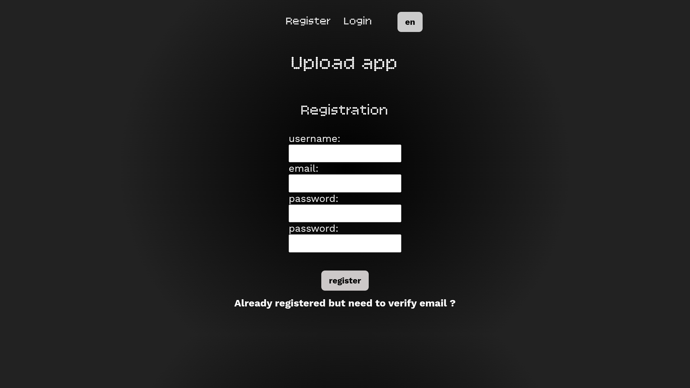
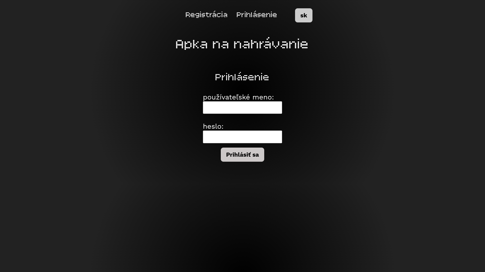
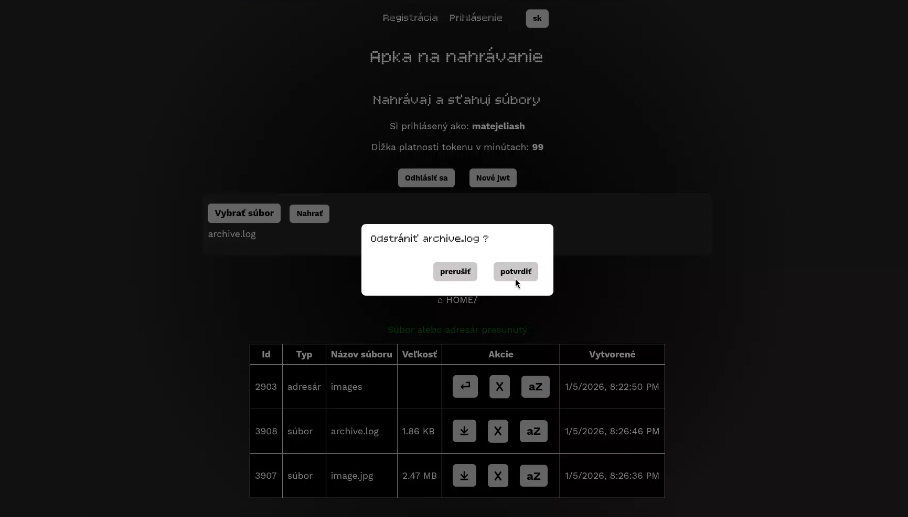
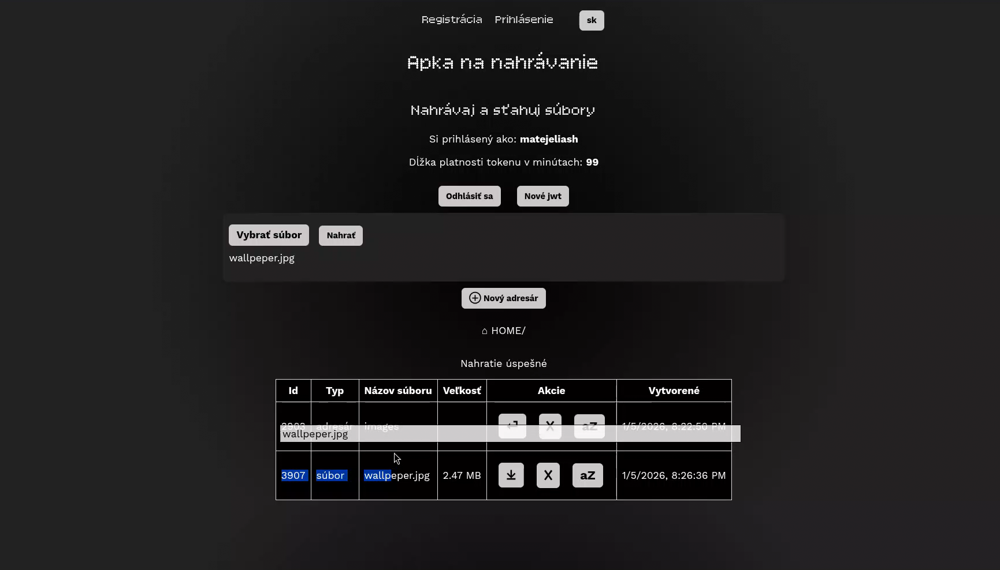

# Springboot upload app


This project is a basic Spring Boot backend/frontend application for uploading files and demonstrating basic account management.
Application is written in Java and used Spring Boot framework.

Basic features of this application:
- Spring Boot Security account management (registration, email verification, login)
- JWT session management with expiration, managed by JWT filter and JWT service
- Data stored in PostgreSQL DB using Spring Boot JPA
- Basic frontend HTML pages written in Thymeleaf
- Communication between frontend and backend using JS, mainly via the Fetch API
- Multilanguage support, currently supporting Slovak and English
- Basic functionality to upload and download files via frontend/API
- Directory structure that allow to create directories and remove files and directories
- Way to move files and directories using drag and drop
- All can be easily  compiled with Dockerfile and run together with Docker Compose

## Showcase

### Video 


https://github.com/user-attachments/assets/86077819-4207-4205-85b3-de38f8c70cc7


### Images
<!-- 


 -->

<table>
  <tr>
    <td></td>
    <td></td>
  </tr>
  <tr>
    <td></td>
    <td></td>
  </tr>
</table>

## How to run and configure

For the application to work, you will need to provide a Gmail account with an app password.

### Run in Docker

The easiest way to run the application is by using Docker. To run the database, backend, and frontend together, install Docker and run the following command in the project’s root directory:
```
docker compose up 
```
For this to work, you need to provide a Gmail account and an app password, and set them as environment variables in the Docker Compose file.


```
SPRING_MAIL_USERNAME: ...
SPRING_MAIL_PASSWORD: ...
```

### Run on system
The Java application can also be compiled and run using Maven. You will need Java JDK 21, and you can run the following command in the project’s root directory:
```
SPRING_MAIL_USERNAME="<example@gmail.com>" \
SPRING_MAIL_PASSWORD="<gmail_app_secret_password>" \
mvn spring-boot:run
 
```
### Configuration changes

In the best-case scenario, all app settings should be easily configurable. In Spring Boot, there are several ways to change configuration variables.
I used the file `application.properties` located in `src/main/resources/application.properties`.

All variables used by Spring Boot, such as the database connection and JWT expiration, can be configured there. Additionally, variables set in `docker-compose` can overwrite those specified in this file.
If you change variables in this file, you can modify the database or use a different email provider for SMTP.
